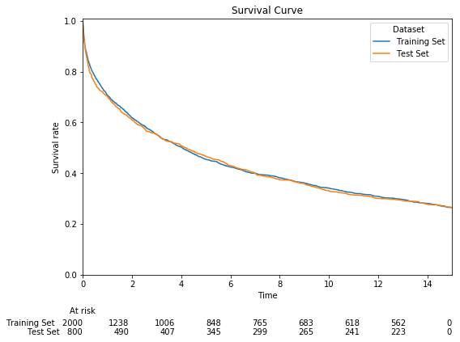
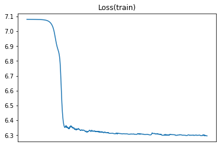
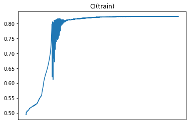
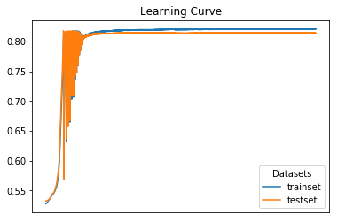
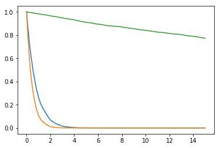

# TFDeepSurv
Deep Cox proportional risk model and survival analysis implemented by tensorflow.

## 1. Differences from DeepSurv
[DeepSurv](https://github.com/jaredleekatzman/DeepSurv), a package of Deep Cox proportional risk model, is open-source on Github. But our works may shine in:

- Evaluating variable importance in deep neural network.
- Identifying ties of death time in your survival data, which means different loss function and estimator for survival function (`Breslow` or `Efron` approximation).
- Providing survival function estimated by three optional algorithm.
- Tuning hyperparameters of DNN using scientific method - Bayesian Hyperparameters Optimization.

## 2. Statement
The project is based on the research of Breast Cancer. The paper about this project has been submitted to IEEE JBHI. We will update status here once paper published !

## 3. Installation
### From source

Download TFDeepSurv package and install from the directory (**Python version : 3.x**):
```bash
git clone https://github.com/liupei101/TFDeepSurv.git
cd TFDeepSurv
pip install .
```

## 4. Get it started:

### 4.1 Runing with simulated data
#### 4.1.1 import packages and prepare data
```python
### import package
from tfdeepsurv import dsl
from tfdeepsurv.dataset import SimulatedData
### generate simulated data
# data configuration: 
#     hazard ratio = 2000
#     number of features = 10
#     number of valid features = 2
data_generator = SimulatedData(2000, num_var=2, num_features=10)
# training dataset: 
#     number of rows = 2000
#     random seed = 1
train_data = data_generator.generate_data(2000, seed=1)
# test dataset :
#     number of rows = 800
#     random seed = 1
test_data = data_generator.generate_data(800, seed=1)
```
#### 4.1.2 Visualize survival status
```python
import matplotlib.pyplot as plt
from lifelines import KaplanMeierFitter
from lifelines.plotting import add_at_risk_counts

### Visualize survival status
fig, ax = plt.subplots(figsize=(8, 6))

l_kmf = []
# training set
kmf = KaplanMeierFitter()
kmf.fit(train_data['t'], event_observed=train_data['e'], label='Training Set')
kmf.survival_function_.plot(ax=ax)
l_kmf.append(kmf)
# test set
kmf = KaplanMeierFitter()
kmf.fit(test_data['t'], event_observed=test_data['e'], label='Test Set')
kmf.survival_function_.plot(ax=ax)
l_kmf.append(kmf)

# 
plt.ylim(0, 1.01)
plt.xlabel("Time")
plt.ylabel("Survival rate")
plt.title("Survival Curve")
plt.legend(loc="best", title="Dataset")
add_at_risk_counts(*l_kmf, ax=ax)
plt.show()
```

result :



#### 4.1.3 Initialize your neural network
```python
input_nodes = 10
output_nodes = 1
train_X = train_data['x']
train_y = {'e': train_data['e'], 't': train_data['t']}
# the arguments of dsnn is obtained by Bayesian Hyperparameters Tuning
model = dsl.dsnn(
    train_X, train_y,
    input_nodes, [6, 3], output_nodes, 
    learning_rate=0.7,
    learning_rate_decay=1.0,
    activation='relu', 
    L1_reg=3.4e-5, 
    L2_reg=8.8e-5, 
    optimizer='adam',
    dropout_keep_prob=1.0
)
# Get the type of ties (three types)
# 'noties', 'breslow' when ties occur or 'efron' when ties occur frequently
print(model.get_ties())
```

#### 4.1.4 Train neural network model
You can train `dsnn` via two optional functions:

- Only for training: `model.train()`. Refer to [#section 4.1.4.a](#414a-training-via-modeltrain)
- For training model and watch the learning curve: `model.learn()`. Refer to [#section 4.1.4.b](#414b-training-via-modellearn)

##### 4.1.4.a Training via model.train()
```python
# Plot curve of loss and CI on train data
model.train(num_epoch=1900, iteration=100,
            plot_train_loss=True, plot_train_ci=True)
```

result :
```
-------------------------------------------------
training steps 1:
loss = 7.07988.
CI = 0.494411.
-------------------------------------------------
training steps 101:
loss = 7.0797.
CI = 0.524628.
-------------------------------------------------
...
...
...
-------------------------------------------------
training steps 1801:
loss = 6.27862.
CI = 0.823937.
```
Curve of loss and CI:

Loss Value                       | CI
:-------------------------------:|:--------------------------------------:
|

##### 4.1.4.b Training via model.learn()
**NOTE**: the function will firstly clean the running state and then train the model from zero.

```python
test_X = test_data['x']
test_y = {'e': test_data['e'], 't': test_data['t']}
# Plot learning curves on watch_list
watch_list = {"trainset": [train_X, train_y], "testset": [test_X, test_y]}
model.learn(num_epoch=1900, iteration=100, eval_list=watch_list,
            plot_ci=True)
```

result :
```
Clean the running state of graph!
-------------------------------------------------
On training steps 1:
    loss on trainset = 7.07953.

    CI on trainset: 0.527526.
    CI on testset: 0.532366.
-------------------------------------------------
...
...
...
-------------------------------------------------
On training steps 1801:
    loss on trainset = 6.33327.

    CI on trainset: 0.820376.
    CI on testset: 0.814369.
```

learning curve:



#### 4.1.5 Evaluate model performance
```python
test_X = test_data['x']
test_y = {'e': test_data['e'], 't': test_data['t']}
print("CI on train set: %g" % model.score(train_X, train_y))
print("CI on test set: %g" % model.score(test_X, test_y))
```
result :
```
CI on train set: 0.823772
CI on test set: 0.812503
```

#### 4.1.6 Evaluate variable importance
```python
model.get_vip_byweights()
```
result:
```
0th feature score : 1.
1th feature score : 0.149105.
2th feature score : -0.126712.
3th feature score : 0.033377.
4th feature score : 0.123096.
5th feature score : 0.0321232.
6th feature score : 0.101529.
7th feature score : -0.0707392.
8th feature score : -0.0415884.
9th feature score : 0.0439712.
```

#### 4.1.7 Get estimation of survival function
```python
# classical algorithm 'bsl' for estimating the baseline survival function is RECOMMENDED
# optional algo: 'wwe', 'bsl' or 'kp', the algorithm for estimating survival function
model.survival_function(test_X[0:3], algo="bsl")
```

result:



### 4.2 Runing with real-world data
The procedure on real-world data is similar with the described on simulated data. One we need to notice is data preparation. This package provides functions for loading standard dataset for traning or testing.

#### 4.2.1 load real-world data
```python
# import package
from tfdeepsurv import dsl
from tfdeepsurv.utils import load_data

# Notice: the object train_X or test_X returned from function load_data is numpy.array.
# the object train_y or test_y returned from function load_data is dict like {'e': numpy.array,'t': numpy.array}.

# You can load training data and testing data, respectively
train_X, train_y = load_data('train.csv', excluded_col=['ID'], surv_col={'e': 'event', 't': 'time'})
test_X, test_y = load_data('test.csv', excluded_col=['ID'], surv_col={'e': 'event', 't': 'time'})
# Or load full data, then split it into training and testing set (=8:2).
train_X, train_y, test_X, test_y = load_data('full_data.csv', excluded_col=['ID'], surv_col={'e': 'event', 't': 'time'}, split_ratio=0.8)
```

#### 4.2.2 Traning or testing tfdeepsurv model
This is the same as doing in simulated data.

## 5. More properties
We provide tools for hyperparameters tuning (Bayesian Hyperparameters Optimization) in deep neural network, which is automatic in searching optimal hyperparameters of DNN.

For more usage of Bayesian Hyperparameters Optimization, you can refer to [here](bysopt/README.md)